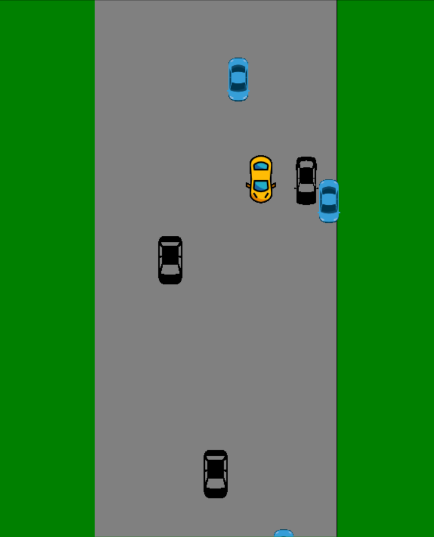

# 9.2-Crash

## Objective:
For this assignment, you will program a game in which the player steers a car that must avoid oncoming traffic.

## Part One:

You will create a Car class, representing the vehicles that the player must avoid in the game. The Car class must include:

1. **Constructor**: The constructor method will initialize each car object. It will assign a car body to the object and determine its initial location with random x and y coordinates. All car objects must appear above the screen out of view of the player.

2. **Drive Method**: This method will be responsible for moving the car object down by ten pixels every time it is called. 

3. **Relocate Method**: When a car drops below the bottom of the screen, the relocate method will be invoked. This function will teleport the car object above the screen to a new random location (x, y coordinates) and assign it a new car body.

Once implemented, cars will continuously loop through the drive and relocate actions, simulating movement and providing a challenge for the player to avoid collisions.